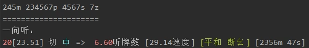
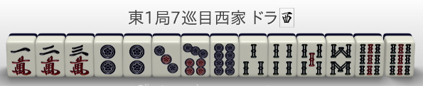
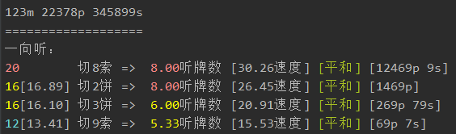
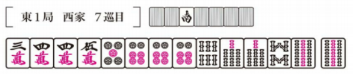
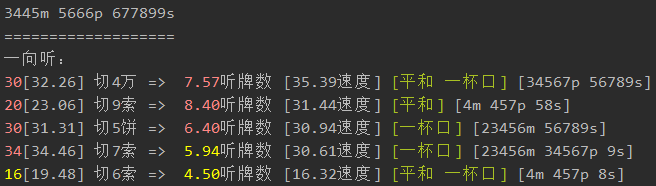
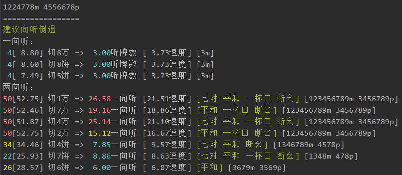
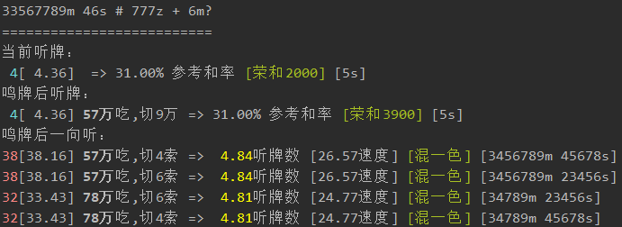
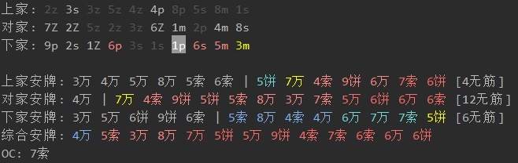

# 리치마작 도우미

이 프로젝트는 [EndlessCheng/mahjong-helper](https://github.com/EndlessCheng/mahjong-helper)를 기반으로 한국어 번역 및 마작 용어 정리를 진행한 버전입니다.
원본 프로젝트의 저작권과 라이선스는 원저작자에게 있으며, 본 저장소는 한국어 사용자를 위한 번역/로컬라이징 목적의 파생 작업입니다.

리치마작 대국과 패보 분석을 보조하는 콘솔 기반 도우미입니다. 손패의 유효패, 샨텐 전진, 타점, 화료율, 위험도 등을 계산해 추천 타패와 수비 정보를 보여줍니다.

## 주요 기능

- 대국 중 손패를 자동 분석하고 유효패, 타점 등을 종합해 추천 타패를 표시
- 상대가 리치했거나 여러 번 후로했을 때 각 패의 위험도를 표시
- 상대의 테다시와 쯔모기리를 기록
- 패보를 따라가며 매 타순의 공격/수비 선택을 추천
- 4인 마작과 3인 마작 지원

## 지원 플랫폼

- 작혼 웹판: [국제 중국어 서버 1](https://game.maj-soul.com/1/) | [국제 중국어 서버 2](https://game.maj-soul.net/1/) | [일본 서버](https://game.mahjongsoul.com) | [국제 서버](https://mahjongsoul.game.yo-star.com)
- 천봉: [Web](https://tenhou.net/3/) | [4K](https://tenhou.net/4/)

## 목차

- [설치](#설치)
- [실행](#실행)
- [사용 방법](#사용-방법)
- [분석 출력 읽기](#분석-출력-읽기)
- [예시](#예시)
- [작혼 연동](#작혼-연동)
- [개발 메모](#개발-메모)

## 설치

### Go 설치

이 저장소에서는 프로젝트 안에 로컬 Go를 설치해 둘 수 있습니다. 현재 작업 폴더 기준으로는 다음 실행 파일을 사용하면 됩니다.

```powershell
.\.tools\go\bin\go.exe version
```

새 PowerShell 또는 VS Code 터미널에서 `go` 명령이 바로 잡히면 아래처럼 짧게 써도 됩니다.

```powershell
go version
```

Go를 새로 설치해야 한다면 공식 다운로드 페이지에서 Windows 64-bit MSI 또는 ZIP을 받으면 됩니다.

https://go.dev/dl/

### 의존성

처음 실행할 때 Go가 `go.mod`에 적힌 의존성을 자동으로 다운로드합니다. 네트워크가 막힌 환경에서는 의존성 다운로드 단계에서 실패할 수 있습니다.

## 실행

프로젝트 폴더로 이동합니다.

```powershell
cd C:\Users\Inseong\Desktop\mahjong-helper-master
```

도움말을 확인합니다.

```powershell
.\.tools\go\bin\go.exe run . -h
```

`go`가 PATH에 잡혀 있으면 다음처럼 실행해도 됩니다.

```powershell
go run . -h
```

손패를 바로 분석하려면:

```powershell
.\.tools\go\bin\go.exe run . 34568m 5678p 23567s
```

대화형 모드:

```powershell
.\.tools\go\bin\go.exe run . -i 34568m 5678p 23567s
```

작혼 도우미 서버:

```powershell
.\.tools\go\bin\go.exe run . -majsoul
```

포트가 충돌하면 다른 포트를 지정합니다.

```powershell
.\.tools\go\bin\go.exe run . -majsoul -p 12122
```

빌드해서 실행 파일을 만들 수도 있습니다.

```powershell
.\.tools\go\bin\go.exe build -o mahjong-helper.exe
.\mahjong-helper.exe
```

## 사용 방법

### 패 입력 형식

수패는 `m`, `p`, `s`, 자패는 `z`로 씁니다.

- `m`: 만수
- `p`: 통수
- `s`: 삭수
- `z`: 자패, 순서는 `동 남 서 북 백 발 중`
- 적5는 `0m`, `0p`, `0s`로 입력합니다.

예:

```powershell
.\.tools\go\bin\go.exe run . 34068m 5678p 23567s
```

후로가 있는 손패는 `#` 뒤에 후로 묶음을 적습니다. 안깡은 대문자로 표시합니다.

```powershell
.\.tools\go\bin\go.exe run . 234688m 34s # 6666P 234p
```

다른 사람이 버린 패에 대해 치/퐁 여부를 분석하려면 `+` 뒤에 해당 패를 적습니다.

```powershell
.\.tools\go\bin\go.exe run . 33567789m 46s + 6m
.\.tools\go\bin\go.exe run . 24688m 34s # 6666P 234p + 3m
```

도라 표시패는 `-d` 또는 `-dora`로 지정합니다.

```powershell
.\.tools\go\bin\go.exe run . -d=38p33m 34568m 5678p 23567s
```

국 수지를 표시하려면 `-s` 또는 `-score`를 붙입니다.

```powershell
.\.tools\go\bin\go.exe run . -d=38p33m -s 34568m 5678p 23567s
```

기타 옵션은 도움말에서 확인할 수 있습니다.

```powershell
.\.tools\go\bin\go.exe run . -h
```

## 분석 출력 읽기

분석 결과는 대체로 다음 정보를 포함합니다.

```text
유효패수[개량 후 유효패 가중 평균] 타패 => 샨텐 전진 후 유효패 가중 평균 [손패 속도] [기대 타점/국 수지] [역] [후리텐 여부] [유효패]
```

보충 설명:

- 개량이 없으면 개량 유효패 수는 생략될 수 있습니다.
- 후로 분석에서는 어떤 패로 치/퐁하는지도 함께 표시합니다.
- 수비 상황에서는 타패 색상이 안전도에 따라 달라집니다.
- 멘젠 텐파이일 때는 리치 기대 점수를 표시합니다. 계산에는 쯔모, 일발, 우라도라 기대치가 반영됩니다.
- 다마텐으로 역이 있으면 다마텐 론 점수도 표시합니다.
- 후로 상태인데 역이 없으면 `[역 없음]`을 표시합니다.
- 텐파이 또는 1샨텐에서는 버림패 상황에 따라 후리텐 가능성을 표시합니다.
- 유효패 묶음은 `[14578만 6삭]`처럼 한글 압축 표기로 표시합니다. `m/p/s` 입력 표기는 각각 만수/통수/삭수로 바꿔 보여주며, 자패는 동/남/서/북/백/발/중으로 표시합니다.
- 1샨텐일 때는 끝에 `[텐파이 진입: ...]`을 표시합니다. 여기에 적힌 패가 들어오면 텐파이로 전진합니다.

유효패 수 색상:

- 빨강: 우수
- 노랑: 보통
- 파랑: 낮음

## 예시

### 패효율

각 타패 선택은 유효패 수, 샨텐 전진 후 유효패 수, 기대 화료율, 만들 수 있는 역 등을 종합해 정렬됩니다. 속도가 빠르고 타점/화료율이 높을수록 위쪽에 표시됩니다.

예시 이미지:



완전 1샨텐 예시:





복합형 1샨텐 예시:





샨텐 후퇴가 필요한 경우:




### 후로 판단

다른 사람이 버린 패에 대해 치/퐁했을 때 샨텐, 유효패, 타점이 어떻게 바뀌는지 비교합니다.



### 테다시/쯔모기리와 안전패

상대의 테다시와 쯔모기리, 현물, 스지, 노찬스/원찬스 등을 참고해 안전패와 위험패를 표시합니다.

상대 버림패 뒤의 `*`는 쯔모기리입니다. 추천 타패 뒤의 `[위험 n.n]`은 현재 보이는 상대 버림패와 후로 정보를 바탕으로 계산한 종합 위험도이며, 숫자가 높을수록 위험합니다.



위험도 색상은 대략 다음 의미입니다.

- 흰색: 안전
- 파랑: 낮은 위험
- 노랑: 중간 위험
- 빨강: 높은 위험
- 보라: 매우 높은 위험

## 작혼 웹판 연동

현재 한국 서버(`https://mahjongsoul.game.yo-star.com/kr/index.html`)는 예전 `code.js` 방식이 아니라 Unity WebGL 빌드에서 WebSocket을 직접 엽니다. 그래서 Header Editor 규칙 JSON은 사용하지 않고, Tampermonkey 스크립트로 WebSocket 송수신 데이터를 로컬 도우미 서버에 전달합니다.

### 도우미 서버 실행

```powershell
.\.tools\go\bin\go.exe run . -majsoul
```

기본 포트는 `12121`입니다. 포트 충돌이 나면:

```powershell
.\.tools\go\bin\go.exe run . -majsoul -p 12122
```

서버가 켜진 상태에서 브라우저로 `https://localhost:12121`을 열어 시간이 표시되는지 확인합니다.

### Tampermonkey 설정

1. Chrome 계열 브라우저에 Tampermonkey 확장을 설치합니다.
2. Tampermonkey 대시보드에서 새 스크립트를 만듭니다.
3. [scripts/majsoul-websocket-hook.user.js](scripts/majsoul-websocket-hook.user.js)의 내용을 전체 복사해 붙여넣고 저장합니다.
4. 스크립트가 켜진 상태에서 작혼 웹판에 접속합니다: `https://mahjongsoul.game.yo-star.com/kr/index.html`

성공하면 브라우저 콘솔에는 `[MJH] WebSocket 생성`, `[MJH] send`, `[MJH] receive` 로그가 뜹니다. 서버 터미널에는 `[majsoul-raw] ...` 로그가 뜹니다.

흐름은 `작혼 웹판 -> Tampermonkey WebSocket hook -> https://localhost:12121/majsoul-raw -> 도우미 서버 로그`입니다.

참고: 현재는 WebSocket 패킷과 `ActionPrototype` 이름까지 해석합니다. `ActionPrototype.data` 내부 액션 본문은 한국 WebGL판에서 추가 난독화/암호화되어 있어 별도 복호화 작업이 더 필요합니다.

## 개발 메모

테스트 실행:

```powershell
.\.tools\go\bin\go.exe test ./...
```

일부 테스트는 외부 작혼 서버 접속, 로컬 로그 파일, 오래된 테스트 데이터에 의존할 수 있습니다. 네트워크 또는 테스트 데이터가 없으면 실패할 수 있습니다.

## 출처

원본 프로젝트: [EndlessCheng/mahjong-helper](https://github.com/EndlessCheng/mahjong-helper)

이 저장소는 위 프로젝트를 기반으로 한국어 번역, 마작 용어 통일, 실행 안내 정리를 진행한 버전입니다. 원본 라이선스는 [LICENSE](LICENSE)를 확인하세요.

문제 제보:

https://github.com/EndlessCheng/mahjong-helper/issues
